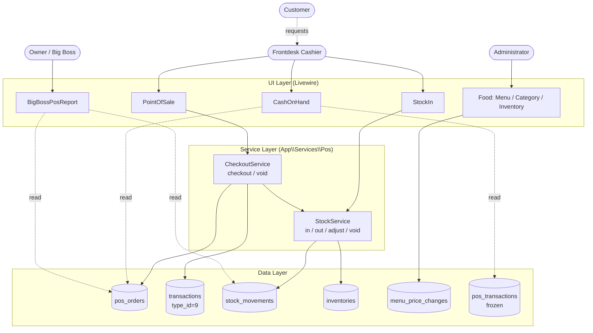
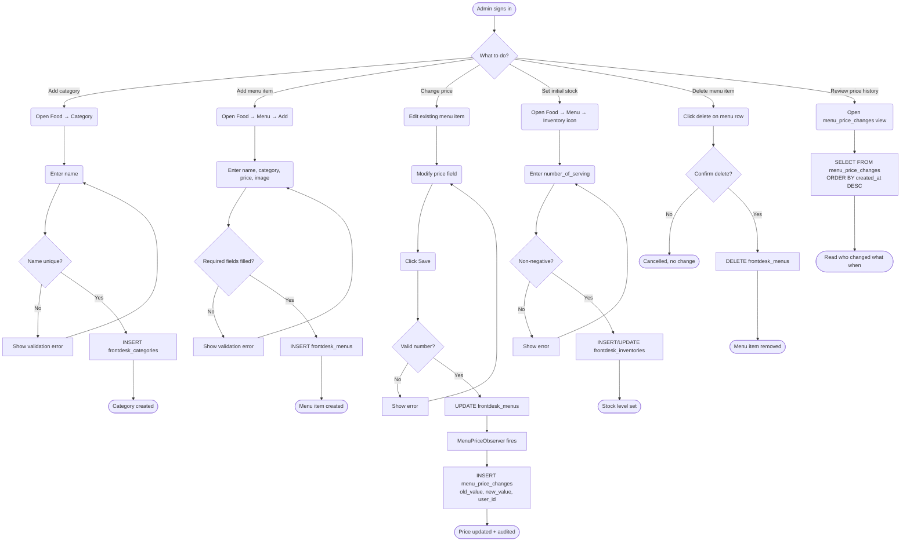
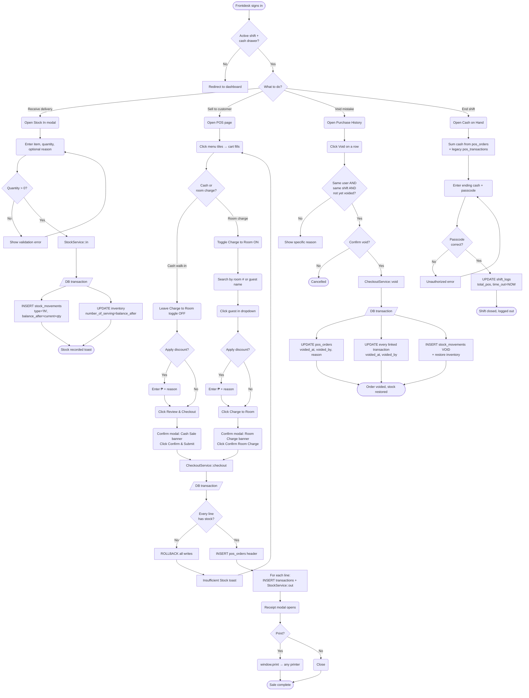
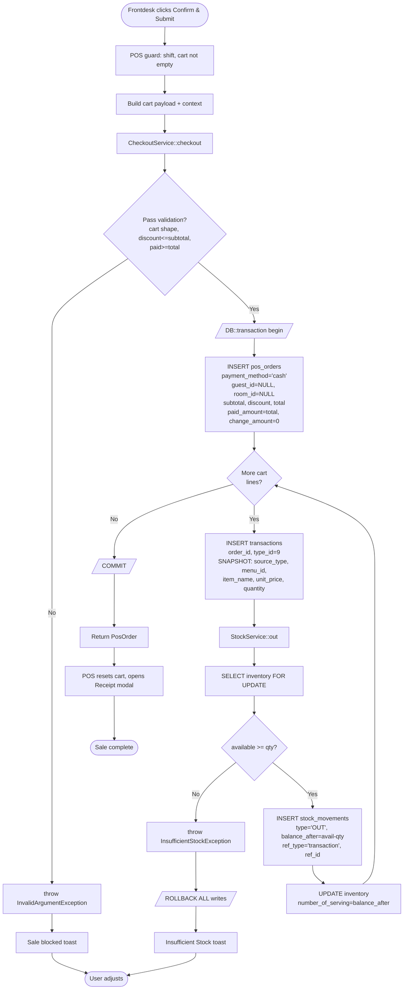
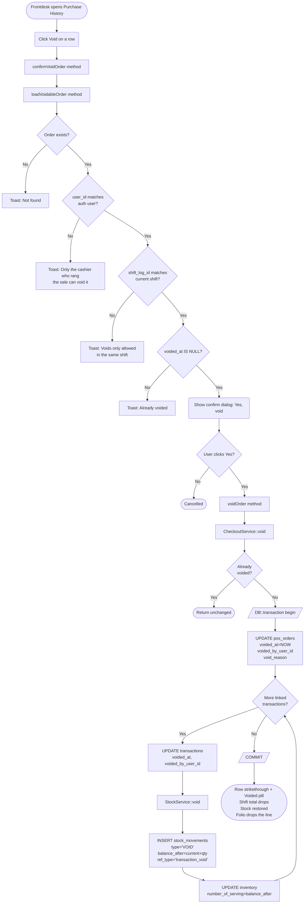
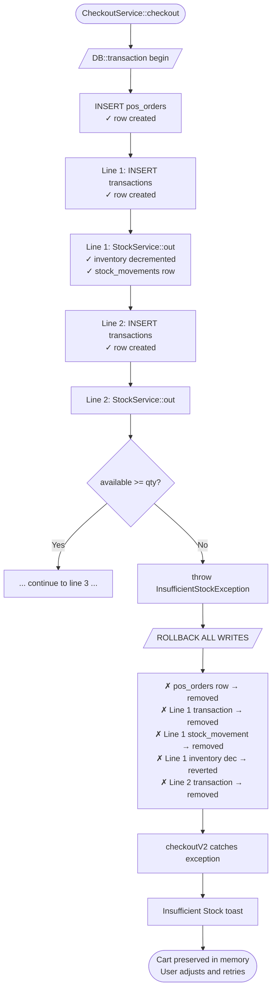

# POS Module — Technical Reference

> **Audience:** Developers, sysadmins, DBAs — anyone who **builds,
> maintains, or deploys** the POS module.
>
> **Looking for the click-by-click how-to guide?** Cashiers, admins,
> and owners should read [`pos-user-manual.md`](./pos-user-manual.md)
> instead. That doc covers screens, buttons, and daily tasks; this one
> covers code, schema, services, and infrastructure.

**Module:** Point of Sale (frontdesk register)
**Branch:** `future-updates` (merged from `pos-rebuild-plan-1`)
**Last updated:** 2026-04-26
**Supersedes:** `pos-module-current-state.md` (pre-rebuild snapshot)

### What's in this doc

| Section | For |
|---|---|
| §1–§4 Overview, roles, architecture, core concepts | Anyone onboarding to the codebase |
| §5 Data model | Backend devs, DBAs |
| §6–§10 Per-feature backend behavior | Backend devs (cross-reference for user-manual workflows) |
| §11 Code reference (services, models, components, migrations) | Backend devs |
| §11.7 Production rollout runbook | Sysadmin / DevOps deploying to prod |
| §12 Verification SQL + recovery procedures | On-call, DBA, anyone debugging incidents |
| §13 Known limitations | Anyone planning future work |
| §14 Log growth, DB backups, log rotation, maintenance timeline | Sysadmin / owner — keep the system healthy as years pass |

---

## Table of Contents

1. [Overview](#1-overview)
2. [Roles and Responsibilities](#2-roles-and-responsibilities)
3. [System Architecture](#3-system-architecture)
4. [Core Concepts](#4-core-concepts)
5. [Data Model](#5-data-model)
6. [Catalog Management (Administrator)](#6-catalog-management-administrator)
7. [Stock Receiving (Frontdesk)](#7-stock-receiving-frontdesk)
8. [Sales Operations (Frontdesk)](#8-sales-operations-frontdesk)
9. [Shift End and Cash Reconciliation](#9-shift-end-and-cash-reconciliation)
10. [Reporting (Owner / Big Boss)](#10-reporting-owner--big-boss)
11. [Code Reference](#11-code-reference)
12. [Verification and Troubleshooting](#12-verification-and-troubleshooting)
13. [Known Limitations](#13-known-limitations)
14. [Log Growth, Backups, and Maintenance](#14-log-growth-backups-and-maintenance)
15. [Glossary](#15-glossary)

---

## 1. Overview

The Point of Sale (POS) module is a frontdesk-operated register for selling
food, drinks, and small items to customers. Each sale is recorded as one
order with one or more line items, and either:

- **Collected as cash** at the register (walk-in customer), or
- **Charged to a guest's room** for settlement at guest checkout.

The module manages its own catalog (categories, menu items, prices) through
the administrator interface, tracks stock through an audited movement log,
and reports per-shift sales and inventory activity to the owner.

### Capabilities

- Cash and room-charge sales in a single register flow
- Discount per order with reason text
- Same-shift, same-cashier void with stock restoration
- Server-rendered receipt printable on any browser-supported printer
  (including thermal)
- Atomic checkout — partial state cannot persist on failure
- Auditable stock movements (IN, OUT, ADJUST, VOID, OPENING) for every
  inventory change across frontdesk POS, kitchen, and pub
- Audit trail for menu price changes
- Per-shift owner report for sales and inventory movement

### Out of scope

- Online payment methods (GCash, card, e-wallets) — schema is prepared but
  user interface is not implemented in this release
- Promo codes, multi-tier pricing, per-item discounts
- Tax-on-top calculation (prices remain tax-inclusive)
- Refund flows other than the same-shift void
- Thermal printer driver integration (handled by the browser print dialog)

---

## 2. Roles and Responsibilities

| Role | Responsibilities | Primary Pages |
|---|---|---|
| **Administrator** | Define POS catalog (categories, menu items, prices). Manage initial inventory levels. Review price-change audit log. | Admin → Food Category, Food Menu, Food Inventory |
| **Frontdesk** | Operate the register. Receive deliveries (Stock-In). Ring sales. Void same-shift mistakes. Print receipts. Reconcile cash at shift end. | Frontdesk → POS, Stock-In, Cash on Hand |
| **Owner / Big Boss** | Review per-shift POS sales and inventory movement. Export or print shift reports. | Back Office → Report Hub → Big Boss POS Report |
| **Kitchen / Pub** | Charge food and drinks to guest rooms via existing kitchen and pub flows. POS module does not change kitchen/pub user interface. | Kitchen, Pub (existing pages) |

---

## 3. System Architecture

The POS module is composed of three layers: a Livewire user interface, a
service layer for business logic, and a relational data layer.

```
┌──────────────────────────────────────────────────────────────────────────┐
│  Presentation (Livewire)                                                 │
│                                                                          │
│   Frontdesk\PointOfSale         Frontdesk\StockIn                        │
│   Frontdesk\CashOnHand          Frontdesk\Food\{Menu,Category,Inventory} │
│   BackOffice\Reports\BigBossPosReport                                    │
└──────────────────────────────┬───────────────────────────────────────────┘
                               │
┌──────────────────────────────▼───────────────────────────────────────────┐
│  Service layer (App\Services\Pos)                                        │
│                                                                          │
│   CheckoutService              StockService                              │
│     • checkout()                 • in()                                  │
│     • void()                     • out()                                 │
│                                  • adjust()                              │
│   InsufficientStockException     • void()                                │
│                                StockSourceResolver                       │
└──────────────────────────────┬───────────────────────────────────────────┘
                               │
┌──────────────────────────────▼───────────────────────────────────────────┐
│  Data layer                                                              │
│                                                                          │
│   pos_orders         transactions (type_id=9)     stock_movements        │
│   menu_price_changes frontdesk_menus              frontdesk_inventories  │
│                      frontdesk_categories         (kitchen + pub mirror) │
│                                                                          │
│   pos_transactions  ─── frozen historical only, not written              │
└──────────────────────────────────────────────────────────────────────────┘
```

All write paths from the Livewire layer pass through the service layer.
Direct inventory writes from Livewire components are not permitted; the
service layer is the single owner of inventory mutations.

---

## 4. Core Concepts

### 4.1 Order versus Transaction

A **POS order** (`pos_orders`) represents one customer interaction at the
register: one cart, one payment decision (cash or room-charge), one
discount (if any), one receipt.

A **transaction** (`transactions` with `transaction_type_id = 9`)
represents one line item within an order. Each cart line produces one
transaction row, linked back to its parent order via `order_id`.

This separation allows the system to:

- Sum cash sales by order (avoiding double counting line items)
- Show per-line snapshots on the receipt
- Void an entire order in a single operation while preserving per-line
  audit detail

### 4.2 Stock Movement Audit

Every change to inventory is recorded as one row in `stock_movements`.
The `type` column identifies the nature of the change:

| Type | Meaning | Direction |
|---|---|---|
| `OPENING` | Initial balance import (one-time backfill) | — |
| `IN` | Stock received via Stock-In form or manual entry | +qty |
| `OUT` | Stock sold via POS, kitchen, or pub | −qty |
| `ADJUST` | Manual correction setting an absolute balance | +/− |
| `VOID` | Reversal of a previous OUT | +qty |

Each row stores `balance_after`, providing a point-in-time snapshot that
allows reconstruction of stock levels at any historical moment without
replaying the entire movement log.

### 4.3 Snapshot Fields (Price Freeze)

Every POS line transaction stores the menu item's name and unit price
**at the time of the sale**, in five snapshot columns:

```
transactions.source_type   -- 'frontdesk' | 'kitchen' | 'pub'
transactions.menu_id       -- reference (do not join for amount)
transactions.item_name     -- frozen at sale time
transactions.unit_price    -- frozen at sale time
transactions.quantity      -- frozen at sale time
```

Once written, these columns are never updated. Receipts and historical
reports always show the price the customer actually paid, regardless of
later menu changes.

### 4.4 Cash Sale versus Room-Charge Sale

| Attribute | Cash Sale | Room-Charge Sale |
|---|---|---|
| `pos_orders.payment_method` | `'cash'` | `NULL` |
| `pos_orders.guest_id` | `NULL` | guest's id |
| `pos_orders.room_id` | `NULL` | room's id |
| `pos_orders.paid_amount` | full total | `0` |
| `pos_orders.change_amount` | as captured | `0` |
| Cash drawer impact | +total | none |
| Settlement | immediate | at guest checkout |
| Inventory impact | identical (decrement on sale) | identical (decrement on sale) |

### 4.5 Voiding

A POS order can be voided **only if all three conditions hold**:

1. The order has not already been voided (`voided_at IS NULL`)
2. The current user is the cashier who rang the order (`user_id` match)
3. The current shift is the same shift the order was rung in
   (`shift_log_id` match)

The void operation is idempotent: repeated calls do not double-restore
stock or modify the void timestamp.

---

## 5. Data Model

### 5.1 Table: `pos_orders` (order header)

| Column | Type | Notes |
|---|---|---|
| `id` | bigint PK | |
| `branch_id` | bigint | scope |
| `user_id` | bigint | the cashier |
| `shift_log_id` | bigint nullable | shift the sale belongs to |
| `guest_id` | bigint nullable | populated for room-charge |
| `room_id` | bigint nullable | populated for room-charge |
| `payment_method` | varchar(20) nullable | `'cash'` or `NULL` |
| `subtotal` | integer | sum of line `payable_amount` before discount |
| `discount_amount` | integer | non-negative; cannot exceed subtotal |
| `discount_reason` | varchar(255) nullable | free-text |
| `total` | integer | `subtotal − discount_amount` |
| `paid_amount` | integer | cash collected (zero for room-charge) |
| `change_amount` | integer | change due (zero for room-charge) |
| `voided_at` | timestamp nullable | set on void |
| `voided_by_user_id` | bigint nullable | cashier who voided |
| `void_reason` | varchar(255) nullable | free-text |
| `created_at`, `updated_at` | timestamps | |

Indexes: `(branch_id, created_at)`, `(shift_log_id)`, `(guest_id)`.

### 5.2 Columns added to `transactions`

| Column | Type | Purpose |
|---|---|---|
| `order_id` | bigint nullable | links a line transaction to its `pos_orders` row |
| `source_type` | varchar(20) nullable | `'frontdesk'` / `'kitchen'` / `'pub'` |
| `menu_id` | bigint nullable | reference to the menu in the relevant table |
| `item_name` | varchar(255) nullable | snapshot at sale time |
| `unit_price` | integer nullable | snapshot at sale time |
| `quantity` | decimal(10,2) nullable | snapshot at sale time |
| `voided_at` | timestamp nullable | mirrors order void |
| `voided_by_user_id` | bigint nullable | mirrors order void |

Index: `voided_at`.

Pre-existing columns that are also written by POS:
`branch_id`, `room_id`, `guest_id`, `floor_id`, `shift_log_id`,
`transaction_type_id` (always `9`), `assigned_frontdesk_id`,
`description`, `payable_amount`, `paid_amount`, `change_amount`,
`deposit_amount`, `remarks`.

Kitchen and pub also continue to write to `transactions` with
`transaction_type_id = 9`. They do not set `order_id`.

### 5.3 Table: `stock_movements`

| Column | Type | Notes |
|---|---|---|
| `id` | bigint PK | |
| `branch_id` | bigint nullable | scope |
| `source_type` | varchar(20) | `'frontdesk'` / `'kitchen'` / `'pub'` |
| `menu_id` | bigint | id in the matching menu table |
| `inventory_id` | bigint | id in the matching inventory table |
| `type` | enum | `IN` / `OUT` / `ADJUST` / `VOID` / `OPENING` |
| `quantity` | decimal(10,2) | always positive; `type` indicates direction |
| `balance_after` | decimal(10,2) | inventory level immediately after this movement |
| `reason` | varchar(255) nullable | supplier name, void reason, etc. |
| `ref_type` | varchar(50) nullable | `'transaction'`, `'transaction_void'`, `'stock_in_form'`, `'manual'` |
| `ref_id` | bigint nullable | id of the source row |
| `user_id` | bigint nullable | actor |
| `shift_log_id` | bigint nullable | shift, when applicable |
| `created_at`, `updated_at` | timestamps | |

Indexes: `(source_type, menu_id)`, `(shift_log_id)`,
`(branch_id, created_at)`.

### 5.4 Table: `menu_price_changes`

| Column | Type | Notes |
|---|---|---|
| `id` | bigint PK | |
| `source_type` | varchar(20) | `'frontdesk'` / `'kitchen'` / `'pub'` |
| `menu_id` | bigint | id in the matching menu table |
| `field` | varchar(50) | `'price'` or `'name'` |
| `old_value` | varchar(255) nullable | |
| `new_value` | varchar(255) nullable | |
| `changed_by_user_id` | bigint nullable | actor |
| `reason` | varchar(255) nullable | optional explanation |
| `created_at`, `updated_at` | timestamps | |

Index: `(source_type, menu_id, created_at)`.

Wired automatically through the `MenuPriceObserver` registered on
`FrontdeskMenu`, `Menu` (kitchen), and `PubMenu`.

### 5.5 Branch flag

The `branches.pos_v2_enabled` column was used during pilot rollout and
has since been removed. POS v2 is the only register flow.

### 5.6 Frozen historical table: `pos_transactions`

The legacy `pos_transactions` table is preserved unchanged. No code
writes to it. It remains queryable for historical access through the
`PosTransaction` model and the `ShiftLog::posTransactions()` relation.
Any shift that pre-dates the rebuild will still report its `total_pos`
correctly because `CashOnHand` sums both old and new sources.

---

## 6. Catalog Management (Administrator)

### 6.1 Categories

**Page:** Admin → Food → Category (`/admin/food/category`)
**Component:** `App\Http\Livewire\Frontdesk\Food\Category`

Categories group menu items for display on the register tile grid (e.g.
"Drinks", "Snacks").

**Operations available:** create, edit, delete.

**Database effect:** `frontdesk_categories(branch_id, name)`.

### 6.2 Menu Items

**Page:** Admin → Food → Menu (`/admin/food/menu`)
**Component:** `App\Http\Livewire\Frontdesk\Food\Menu`

Each menu item belongs to one category. Required fields: name, price,
category. Optional: image, item code.

**Database effect:** `frontdesk_menus(branch_id, frontdesk_category_id, name, price, image, item_code)`.

> **Note on price storage.** The `price` column is `VARCHAR`, not
> `DECIMAL`. Enter raw numbers (`60` or `60.00`); do not include currency
> symbols or formatting. A future migration is planned to convert this
> column to `DECIMAL(10,2)`.

**Editing the price** triggers two writes inside the same request:

1. Update on `frontdesk_menus`
2. Insert into `menu_price_changes` recording old value, new value, and
   the user responsible

### 6.3 Initial Inventory Levels

**Page:** Admin → Food → Menu → Inventory icon (`/admin/food/inventory/{menu_id}`)
**Component:** `App\Http\Livewire\Frontdesk\Food\Inventory`

Sets the starting `number_of_serving` for a menu item.

**Database effect:** `frontdesk_inventories(branch_id, frontdesk_menu_id, number_of_serving)`.

For routine restocking (deliveries, replenishment), use the frontdesk
**Stock-In** form instead of editing inventory directly. Stock-In creates
an audit row in `stock_movements`, while direct edits do not.

---

## 7. Stock Receiving (Frontdesk)

**Page:** Frontdesk → POS → Stock In (`/frontdesk/stock-in`)
**Component:** `App\Http\Livewire\Frontdesk\StockIn`

### Form fields

- **Item** (required) — searchable picker over `FrontdeskMenu`
- **Quantity received** (required) — must be greater than zero
- **Reason / Note** (optional) — supplier name, purchase order number, etc.

### Backend behavior

Submission delegates to `StockService::in(sourceType, menuId, qty, context)`.
The service performs both writes inside one database transaction:

1. **`stock_movements` insert** with:
   - `type = 'IN'`
   - `quantity = entered amount`
   - `balance_after = previous balance + quantity`
   - `ref_type = 'stock_in_form'`
   - `user_id`, `branch_id`, `reason`
2. **`frontdesk_inventories` update** (or insert if no row existed) setting
   `number_of_serving = balance_after`

### Verification query

```sql
SELECT id, type, quantity, balance_after, reason, created_at
FROM stock_movements
WHERE source_type = 'frontdesk' AND menu_id = <menu_id>
ORDER BY id DESC
LIMIT 5;
```

The latest `balance_after` must equal the current
`frontdesk_inventories.number_of_serving` for that item.

---

## 8. Sales Operations (Frontdesk)

**Page:** Frontdesk → POS (`/frontdesk/frontdesk-point-of-sale`)
**Component:** `App\Http\Livewire\Frontdesk\PointOfSale`

### 8.1 Prerequisites

The POS page requires the cashier to have:

- An open shift (`shift_logs.time_out IS NULL`) for the current cash drawer
- An assigned `cash_drawer_id` on the user record

If either is missing, the user is redirected to the frontdesk dashboard.

### 8.2 Building the Cart

The left panel displays a tile grid of menu items, filterable by category
and free-text search. Clicking a tile adds one unit to the cart. Cart
manipulation is in-memory; no database writes occur until checkout.

Stock is enforced at add-to-cart time: items at zero stock are disabled
("Unavailable"), and incrementing past available stock shows a "Stock
limit" notification.

### 8.3 Cash Sale

1. Add items to cart.
2. Leave **"Charge to a room?"** toggled off.
3. Optionally enter a discount in pesos. If a discount is entered, a
   reason field appears.
4. Click **"Review & Checkout"**. The confirmation modal displays the
   itemized cart, subtotal, discount, total, and a green "Cash Sale"
   banner.
5. Click **"Confirm & Submit"**.

#### Database effects (single transaction via `CheckoutService::checkout`)

1. Insert one row into `pos_orders`:
   - `payment_method = 'cash'`
   - `guest_id = NULL`, `room_id = NULL`
   - `subtotal`, `discount_amount`, `discount_reason`, `total`
   - `paid_amount = total`, `change_amount = 0`
2. For each cart line, insert one row into `transactions`:
   - `transaction_type_id = 9`
   - `order_id = pos_orders.id`
   - Snapshot fields populated (see [4.3](#43-snapshot-fields-price-freeze))
3. For each cart line, `StockService::out` writes:
   - One `stock_movements` row with `type = 'OUT'`,
     `ref_type = 'transaction'`, `ref_id = transactions.id`
   - Decrement of `frontdesk_inventories.number_of_serving`
4. The Receipt modal opens automatically.

**Failure semantics.** If any line cannot be fulfilled (insufficient
stock at the moment of write, after a concurrent sale), the entire
transaction rolls back. No order header, no transactions, and no stock
movements persist.

### 8.4 Room-Charge Sale

1. Add items to cart.
2. Toggle **"Charge to a room?"** on.
3. In the search input, type a room number or guest name. Select the
   guest from the dropdown.
4. The selected-guest preview displays the room number, guest name, and
   open POS balance for that guest's current stay.
5. Optionally enter a discount.
6. Click **"Charge to Room"**. The confirmation modal displays a blue
   "Room Charge" banner with the room and guest.
7. Click **"Confirm Room Charge"**.

#### Differences from cash sale

- `pos_orders.payment_method = NULL`
- `pos_orders.guest_id`, `room_id` populated
- `pos_orders.paid_amount = 0`, `change_amount = 0` (no cash collected)
- Each line `transaction` carries `guest_id`, `room_id`, `floor_id`,
  making the line visible on the guest's folio at checkout

### 8.5 Discount

The Discount field accepts non-negative integer pesos. When greater than
zero, a reason input appears. The system validates at checkout that
`discount_amount <= subtotal`; otherwise the sale is blocked with the
message *"Discount cannot exceed subtotal."*

### 8.6 Void (same shift, same cashier)

**Page:** POS → Purchase History modal

Each non-voided order in the current shift displays a **Void** button.
Clicking it shows a confirmation dialog. The same authorization rules
described in [4.5](#45-voiding) apply.

#### Database effects (single transaction via `CheckoutService::void`)

1. Update `pos_orders`: `voided_at`, `voided_by_user_id`, `void_reason`
2. Update each linked `transactions` row: `voided_at`, `voided_by_user_id`
3. For each line, `StockService::void` writes:
   - One `stock_movements` row with `type = 'VOID'`,
     `ref_type = 'transaction_void'`, `ref_id = transactions.id`
   - Restore of `frontdesk_inventories.number_of_serving` by the original
     line quantity

The voided order remains visible in Purchase History, rendered with
strikethrough and a "Voided" pill, and is excluded from the running
shift total displayed at the top of the POS page.

### 8.7 Receipt

After a successful checkout, the Receipt modal opens automatically
displaying a server-rendered HTML receipt. The **Print** button invokes
the browser's native print dialog; any installed printer (including
thermal) can be selected.

The receipt CSS is designed to render cleanly on both narrow thermal
rolls (58mm and 80mm) and standard letter-size paper. It uses a single
narrow column, monospace typography, no background colors, and dashed
rules in place of borders to maximize compatibility with thermal print
heads.

#### Receipt content

- Branch name (uppercase header)
- Date and time
- Cashier name
- Order number
- Line items: name on its own line, then `qty × unit_price = line total`
- Subtotal, discount (if any, with reason), TOTAL
- Payment line:
  - Cash sales: `CASH ₱amount` and `CHANGE ₱amount` (if any)
  - Room-charge sales: `ROOM CHARGE / RM <number> / <guest name>` and
    "Will be settled at guest checkout."
- "Thank you" footer
- A `** VOIDED **` stamp appears if the order was voided after the
  receipt was originally rendered

### 8.8 Running Shift Total

The POS page header displays the cashier's running total of cash sales
for the current shift. The query, executed on every render:

```sql
SELECT SUM(total) FROM pos_orders
WHERE shift_log_id = <current_shift_id>
  AND user_id = <current_user_id>
  AND voided_at IS NULL
  AND payment_method = 'cash';
```

This figure feeds directly into the Cash on Hand reconciliation at
shift end.

---

## 9. Shift End and Cash Reconciliation

**Page:** Frontdesk → Cash on Hand
**Component:** `App\Http\Livewire\Frontdesk\CashOnHand`

At shift end, the cashier's POS cash total is computed as the **sum of
two queries** to support transition shifts that straddle the rebuild:

1. **POS v2 (current):**
   ```sql
   SELECT SUM(total) FROM pos_orders
   WHERE shift_log_id = <shift_id>
     AND user_id = <user_id>
     AND voided_at IS NULL
     AND payment_method = 'cash';
   ```
2. **Legacy (pre-rebuild):**
   ```sql
   SELECT SUM(total) FROM pos_transactions
   WHERE shift_log_id = <shift_id>
     AND user_id = <user_id>;
   ```

The combined value is written to `shift_logs.total_pos` when the shift
is closed. For shifts opened after the rebuild, the legacy term is
always zero. For closed historical shifts, the value already stored is
unchanged.

---

## 10. Reporting (Owner / Big Boss)

**Page:** Back Office → Report Hub → "Big Boss POS Report"
**Component:** `App\Http\Livewire\BackOffice\Reports\BigBossPosReport`

The report is scoped per shift session. The session selector lists all
closed shifts in the current week (configurable by `weekStart`), grouped
by date and shift type so multiple cashiers in the same shift appear as
one session.

### 10.1 POS Sales section

For each order in the selected session:

- Time, order number, cashier
- Type (CASH or ROOM)
- Guest and room (room-charge orders only)
- Itemized line items
- Subtotal, discount (with reason), total
- Voided indicator

Footer subtotals (excluding voided orders):

- Cash sales total
- Room-charge sales total
- Gross POS

If any orders were voided in the session, a notice indicates the count
and that they are excluded from the subtotals above.

### 10.2 Inventory Movement section

For each menu item that had at least one stock movement during the
session's `[time_in, time_out]` window:

| Column | Definition |
|---|---|
| Source | `frontdesk` / `kitchen` / `pub` |
| Item | Menu item name |
| Opening | `balance_after` of the most recent movement before `time_in`, or zero if none exists |
| In | Sum of `quantity` for `IN` and `VOID` movements within the window |
| Out | Sum of `quantity` for `OUT` movements within the window |
| Closing | `balance_after` of the latest movement within the window, or `Opening` if no movements occurred |

Items with no shift activity are omitted to keep the report focused.

### 10.3 Export

- **Print Report** invokes the browser's print dialog on the on-screen view
- **Export HTML** downloads a standalone, self-contained HTML file
  suitable for archiving or emailing

---

## 11. Code Reference

### 11.1 Services

| File | Responsibility |
|---|---|
| `app/Services/Pos/CheckoutService.php` | Single entry point for POS checkout and void |
| `app/Services/Pos/StockService.php` | All inventory mutations (IN, OUT, ADJUST, VOID, OPENING) |
| `app/Services/Pos/StockSourceResolver.php` | Maps `source_type` to inventory model and FK column |
| `app/Services/Pos/InsufficientStockException.php` | Thrown when stock is insufficient for a requested OUT |

### 11.2 Models

| File | Purpose |
|---|---|
| `app/Models/PosOrder.php` | Order header (sales) |
| `app/Models/StockMovement.php` | Movement log; defines `TYPE_*` and `SOURCE_*` constants |
| `app/Models/MenuPriceChange.php` | Price audit log |
| `app/Models/PosTransaction.php` | Frozen historical model (read-only) |

### 11.3 Livewire Components

| File | Responsibility |
|---|---|
| `app/Http/Livewire/Frontdesk/PointOfSale.php` | Register UI: cart, checkout, void, receipt modal |
| `app/Http/Livewire/Frontdesk/StockIn.php` | Stock receiving form |
| `app/Http/Livewire/Frontdesk/CashOnHand.php` | Shift cash reconciliation (reads new + legacy) |
| `app/Http/Livewire/Frontdesk/Food/Menu.php` | Catalog menu items (admin context) |
| `app/Http/Livewire/Frontdesk/Food/Category.php` | Catalog categories |
| `app/Http/Livewire/Frontdesk/Food/Inventory.php` | Initial inventory levels |
| `app/Http/Livewire/Kitchen/Transaction.php` | Kitchen room-charge flow (uses `StockService`) |
| `app/Http/Livewire/Pub/PubTransaction.php` | Pub room-charge flow (uses `StockService`) |
| `app/Http/Livewire/BackOffice/Reports/BigBossPosReport.php` | Per-shift owner report |
| `app/Http/Livewire/BackOffice/ReportHub.php` | Report dispatcher (registers Big Boss POS Report) |

### 11.4 Observers

| File | Watches | Writes |
|---|---|---|
| `app/Observers/MenuPriceObserver.php` | `FrontdeskMenu`, `Menu`, `PubMenu` | `menu_price_changes` |

### 11.5 Views

| File | Purpose |
|---|---|
| `resources/views/livewire/frontdesk/point-of-sale.blade.php` | Register UI |
| `resources/views/livewire/frontdesk/pos/receipt.blade.php` | Server-rendered receipt partial |
| `resources/views/livewire/frontdesk/stock-in.blade.php` | Stock-In form |
| `resources/views/livewire/back-office/reports/big-boss-pos-report.blade.php` | On-screen report |
| `resources/views/livewire/back-office/reports/big-boss-pos-report-export.blade.php` | Downloadable export |

### 11.6 Migrations

| File | Effect | Idempotent |
|---|---|---|
| `2026_04_25_120001_make_transactions_guest_room_floor_nullable.php` | Allows POS cash sales (no guest) | ✓ (MySQL `MODIFY` is idempotent) |
| `2026_04_25_120002_create_stock_movements_table.php` | Movement audit log | ✓ (`hasTable` guard) |
| `2026_04_25_120003_backfill_stock_movements_opening_balances.php` | OPENING backfill | ✓ (per-row `exists` check) |
| `2026_04_25_120004_add_snapshot_columns_to_transactions_table.php` | Frozen line-item snapshot | ✓ (per-column `hasColumn` guards) |
| `2026_04_25_120005_create_menu_price_changes_table.php` | Price audit | ✓ (`hasTable` guard) |
| `2026_04_25_120006_create_pos_orders_table.php` | Order header | ✓ (`hasTable` guard) |
| `2026_04_25_120007_add_order_id_to_transactions_table.php` | Header link | ✓ (`hasColumn` + `SHOW INDEX` guards) |
| `2026_04_26_120002_add_void_columns_for_pos_v2.php` | Void support | ✓ (per-column + index guards) |

All eleven POS migrations are safe to re-run on any database state — fresh,
fully-migrated, or partially-applied. Designed this way after a real staging
incident where a partial migration left a half-applied state.

The flag column added by `2026_04_26_120001_add_pos_v2_enabled_to_branches_table.php`
was removed by `2026_04_26_120003_drop_pos_v2_enabled_make_v2_default.php`.

### 11.7 Production Rollout Runbook

When merging the POS module to `master` and deploying to a production server
that has not yet run these migrations:

```bash
# 1. Backup (non-negotiable)
mysqldump -u root -p --single-transaction --quick <DBNAME> \
  > /backup/pre_pos_migrate_$(date +%Y%m%d_%H%M).sql

# 2. Maintenance mode (HTTP 503 to all users)
php artisan down --retry=120

# 3. Pull and migrate
git pull origin master
php artisan migrate --force
php artisan optimize:clear

# 4. Smoke test (load /admin/dashboard, /frontdesk/dashboard in private tab)

# 5. Bring back online
php artisan up
```

**Expected duration:** ~1–2 minutes total. The slowest single step is
`make_transactions_guest_room_floor_nullable`, which runs three `ALTER TABLE
... MODIFY` statements against `transactions`. Observed ~15 seconds on
staging; production may be longer depending on row count. Maintenance mode
prevents cashiers from hitting a locked table during the ALTER.

**Rollback (if smoke test fails):**

```bash
mysql -u root -p <DBNAME> < /backup/pre_pos_migrate_*.sql
git checkout <previous-master-sha>
php artisan optimize:clear
php artisan up
```

---

## 12. Verification and Troubleshooting

### 12.1 Spot-Check Queries

**Most recent orders with line summary:**

```sql
SELECT po.id, po.payment_method, po.guest_id, po.total,
       po.paid_amount, po.voided_at,
       COUNT(t.id) AS line_count, SUM(t.payable_amount) AS lines_sum
FROM pos_orders po
LEFT JOIN transactions t ON t.order_id = po.id
GROUP BY po.id
ORDER BY po.id DESC
LIMIT 5;
```

**Most recent stock movements:**

```sql
SELECT id, source_type, menu_id, type, quantity, balance_after,
       ref_type, ref_id, created_at
FROM stock_movements
ORDER BY id DESC LIMIT 10;
```

**Drift detection — `stock_movements.balance_after` vs current inventory:**

```sql
SELECT
  sm.source_type, sm.menu_id, sm.balance_after AS movement_says,
  CASE sm.source_type
    WHEN 'frontdesk' THEN (SELECT number_of_serving FROM frontdesk_inventories WHERE id = sm.inventory_id)
    WHEN 'kitchen'   THEN (SELECT number_of_serving FROM inventories             WHERE id = sm.inventory_id)
    WHEN 'pub'       THEN (SELECT number_of_serving FROM pub_inventories         WHERE id = sm.inventory_id)
  END AS inventory_says
FROM stock_movements sm
WHERE sm.id IN (
  SELECT MAX(id) FROM stock_movements GROUP BY source_type, inventory_id
)
HAVING movement_says <> inventory_says;
```

A result of zero rows confirms the audit log and live inventory tables
are in sync.

### 12.2 Common Symptoms

| Symptom | Likely Cause | Resolution |
|---|---|---|
| Item appears as "Unavailable" despite expected stock | No `frontdesk_inventories` row, or `number_of_serving = 0` | Use Stock-In to receive stock (creates audit row) or set initial inventory in admin |
| Sale fails with "Insufficient stock" mid-transaction | Concurrent sale decremented stock between cart and checkout | Refresh and retry; the sale was rolled back atomically |
| Room-charge does not appear in Big Boss Report's per-guest "foods" column | Pre-existing gap: kitchen/pub/POS room-charge transactions do not set `checkin_detail_id` | Use the Big Boss POS Report instead, which shows all POS regardless |
| Receipt format is wrong on a specific thermal printer | CSS rendering quirk in the printer driver | Print to PDF as workaround; report the printer model for investigation |
| POS cash total in header differs from Big Boss POS Report | Header shows current user's sales only; report shows entire shift session (all cashiers) | Expected behavior |
| Migration fails with "table already exists" | Pre-idempotency artifact from old branch | All POS migrations now self-skip via `hasTable` / `hasColumn` guards. If you still see this, you are running a pre-`c6ca3ca` revision — pull latest. |

### 12.3 Recovery Procedures

**Restore a lost migration tracker entry** (when a table exists but the
migration is marked Pending):

```sql
INSERT INTO migrations (migration, batch)
VALUES ('<migration_filename_without_extension>', <next_batch_number>);
```

**Reverse a manual inventory adjustment** that was made through admin
rather than Stock-In: use `StockService::adjust(sourceType, menuId,
absoluteBalance, ['reason' => 'manual correction'])` from tinker. The
service automatically writes a corresponding `ADJUST` row in
`stock_movements`.

**Verify atomicity** of a recent failed checkout: if a customer reports
a charge that did not produce a receipt, query `pos_orders`,
`transactions`, and `stock_movements` for the relevant timestamp window.
Either all three contain the data or none of them do; partial state is
not possible.

---

## 13. Known Limitations

1. **`frontdesk_menus.price` is `VARCHAR(255)`.** Conversion to
   `DECIMAL(10,2)` is planned as a separate migration.
2. **No payment-method tracking beyond cash.** The `payment_method`
   column accepts other values (`gcash`, `card`, etc.) and is reserved
   for future use, but the user interface only collects cash.
3. **No tax-on-top calculation.** Prices are treated as tax-inclusive.
4. **Kitchen, pub, and room-charge POS transactions do not populate
   `transactions.checkin_detail_id`.** As a result, the existing Big
   Boss Report's per-guest "foods" column does not include these
   transactions. The Big Boss POS Report displays them correctly. This
   is a pre-existing condition not introduced by the rebuild.
5. **Cart state is not persisted.** A page refresh during cart-building
   discards the cart. Saved carts and cross-device cart resumption are
   out of scope.
6. **No partial refund.** Only full-order void is supported, and only
   within the same shift by the same cashier.
7. **`pos_transactions` table is preserved but frozen.** Retirement
   (after a sufficient period of stable v2 operation) will be a
   separate task.

---

## 14. Log Growth, Backups, and Maintenance

### 14.1 Growth Math

POS-related tables grow continuously. The current design holds up
without intervention for years. The numbers below are estimates for one
branch averaging ~50 POS sales per day (~3 items each).

| Table | Rows per sale | Per year | After 5 years | After 10 years |
|---|---|---|---|---|
| `pos_orders` | 1 | ~18,000 | ~91,000 | ~182,000 |
| `transactions` (POS lines only) | ~3 | ~54,000 | ~273,000 | ~547,000 |
| `stock_movements` (POS sales + restocks) | ~3 | ~54,000 | ~273,000 | ~547,000 |
| `menu_price_changes` | rare | < 100 | < 500 | < 1,000 |
| `activity_logs` (Spatie) | varies | varies | monitor | archive at year 3 |

The non-POS contribution to `transactions` (room fees, deposits,
discounts) is the larger driver. Across multiple branches, multiply the
estimates by branch count.

### 14.2 Why It Stays Fast

Every audit query in the POS module filters on `created_at`:

| Page / Report | Default range | Index used |
|---|---|---|
| Stock Movements (`/admin/stock-movements`) | last 7 days | `stock_movements (branch_id, created_at)` |
| Price Changes (`/admin/price-changes`) | last 30 days | `menu_price_changes (source_type, menu_id, created_at)` |
| Big Boss POS Report | one shift session | `transactions (shift_log_id)`, `pos_orders (shift_log_id)` |
| Purchase History (POS register) | current shift only | `pos_orders (shift_log_id)` |

Combined with pagination (25 rows per page on the audit pages), a
million-row table produces sub-second queries. None of the UI does a
full-table scan.

### 14.3 Three-Tier Maintenance Timeline

| Year | Symptom | Action |
|---|---|---|
| **0–3** | None — queries fast | Monitor table sizes quarterly (one query, see below) |
| **3–5** | Audit pages take 2–3 sec on broad date ranges | Add monthly partitioning to `stock_movements` and the POS slice of `transactions` |
| **5+** | Queries slow even with date filter | Archive: move rows older than 2 years to `_archive` sibling tables. Old data stays queryable but off the hot table. |

**Important:** No deletion. Archival moves rows to a sibling table that
is still SQL-queryable. Historical receipts, audit trails, and reports
remain readable forever.

### 14.4 Quarterly Health Check Query

Run this against the production read replica or a copy of prod:

```sql
SELECT table_name,
       table_rows,
       ROUND(data_length / 1024 / 1024, 1)  AS data_mb,
       ROUND(index_length / 1024 / 1024, 1) AS index_mb
FROM information_schema.tables
WHERE table_schema = DATABASE()
  AND table_name IN (
    'transactions', 'pos_orders', 'stock_movements',
    'menu_price_changes', 'activity_logs'
  )
ORDER BY data_length DESC;
```

**Action thresholds:**
- Any table > 1M rows → review query plans for that table
- `transactions.data_mb` > 500MB → start planning partitioning
- `activity_logs` > 100MB → consider Spatie's prune command

### 14.5 Database Backups

**The application does NOT back up the database.** Backups are a
server-level cron job using `mysqldump`. Set this up on every
production and staging server.

**Step 1 — Credentials file** (so the cron doesn't store passwords):

```bash
sudo nano /root/.my.cnf
```

```ini
[client]
user=root
password=YOUR_DB_PASSWORD
host=localhost
```

```bash
sudo chmod 600 /root/.my.cnf
```

**Step 2 — Backup script** at `/usr/local/bin/db-backup.sh`:

```bash
#!/bin/bash
set -e
DBNAME="hotel_v2_production"   # change per environment
TS=$(date +%Y%m%d_%H%M)
DEST="/backup/mysql/${DBNAME}_${TS}.sql.gz"

mkdir -p /backup/mysql
mysqldump --single-transaction --quick --routines --triggers \
  "$DBNAME" | gzip > "$DEST"

# Keep last 30 days
find /backup/mysql -name "${DBNAME}_*.sql.gz" -mtime +30 -delete

echo "$(date): backup -> $DEST ($(du -h $DEST | cut -f1))" \
  >> /var/log/db-backup.log
```

```bash
sudo chmod 700 /usr/local/bin/db-backup.sh
```

**Step 3 — Schedule daily at 2:30 AM:**

```bash
sudo crontab -e
# add:
30 2 * * * /usr/local/bin/db-backup.sh
```

**Step 4 — Off-server copy (REQUIRED for true safety):**

A backup that lives on the same VPS as the database does not survive
disk failure or VPS deletion. Add one of these to the script:

```bash
# Option A — SCP to a separate server
scp "$DEST" backup-user@backup-server:/remote/backup/

# Option B — S3 / DigitalOcean Spaces (needs awscli configured)
aws s3 cp "$DEST" s3://your-bucket/db-backups/

# Option C — Google Drive via rclone
rclone copy "$DEST" gdrive:hotel-backups/
```

**Restore procedure:**

```bash
gunzip < /backup/mysql/hotel_v2_production_20260426_0230.sql.gz \
  | mysql hotel_v2_production
```

### 14.6 Laravel Log Rotation

`storage/logs/laravel.log` grows forever in the default config.
Switch to daily rotation in `.env`:

```ini
LOG_CHANNEL=daily
LOG_DAILY_DAYS=14
```

This produces `laravel-YYYY-MM-DD.log` files; older than 14 days are
auto-deleted by Laravel itself. No cron required.

### 14.7 When You Hit Year 3+ — Partitioning Template

When the quarterly check shows the warning thresholds, partition
`stock_movements` by month using `RANGE` on `YEAR(created_at)*100 +
MONTH(created_at)`. The migration template is documented separately
under "Future maintenance" — when you're ready, file an issue and the
on-call dev will produce the partition migration.

The pattern is well-known and reversible. Don't preemptively partition
— the overhead isn't justified before year 3.

---

## 15. Glossary

**Cart** — The in-memory list of menu items and quantities the cashier
has selected but not yet checked out. Stored as a Livewire component
property; lost on page refresh.

**Cash drawer** — A physical till assigned to a cashier for the
duration of a shift. Tracked in `cash_drawers`; required to operate POS.

**Cashier** — The frontdesk user logged in with an open shift and
assigned drawer.

**Folio** — A guest's accumulated charges during a stay. Settled at
checkout.

**Movement** — A row in `stock_movements`. Every inventory change
produces exactly one movement.

**Open POS balance** — The running total of POS room-charge sales a
guest has accumulated during their current stay, displayed on the
guest-search dropdown and selected-guest preview card. Computed as
`SUM(transactions.payable_amount)` for non-voided `pos_orders` linked
to the selected guest. Each check-in creates a new `guests` row, so
this figure naturally scopes to the current stay only.

**Order** — A `pos_orders` row. One customer interaction at the
register.

**Room charge** — A POS sale with no cash collected, attributed to a
checked-in guest's folio.

**Session (shift session)** — One logical shift, possibly aggregating
multiple `shift_logs` rows when several cashiers worked the same shift.
Used by Big Boss POS Report.

**Snapshot** — A field on a transaction that records a value (item
name, unit price, quantity) at the moment of sale and is never updated
afterward. Ensures historical accuracy.

**Stock movement** — See *Movement*.

**Transaction** — A single line item within an order. One row per cart
line in the `transactions` table with `transaction_type_id = 9`.

**Void** — Reversal of an order, restoring inventory and excluding the
order from cash totals. Same shift, same cashier only.

---

*This document is the canonical reference for the POS module. For the
testing playbook, see the related [POS Testing Sequence](#9-test-sequence)
in the appendix below. For historical design rationale, see
`2026-04-25-pos-module-rebuild-design.md`.*

---

## Appendix A: Recommended Test Sequence

The following sequence exercises every supported flow. Run in order.

1. **Catalog setup.** Create one category. Add two menu items (e.g. Coke
   ₱60, Chips ₱50). Set initial inventory to 10 each.
2. **Stock receiving.** Open Stock-In; receive 5 Coke. Verify
   `frontdesk_inventories.number_of_serving` is 15 and a corresponding
   `stock_movements` row exists with `type='IN'`, `balance_after=15`.
3. **Cash sale.** Ring 2 Coke and 1 Chips. Confirm receipt total of ₱170.
   Verify one `pos_orders` row, two `transactions` rows linked via
   `order_id`, two `stock_movements` rows with `type='OUT'`, and
   inventory of 13 Coke and 9 Chips.
4. **Discount.** Ring 1 Chips. Enter ₱10 discount with reason "test".
   Confirm modal shows total ₱40. Verify
   `pos_orders.discount_amount=10`, `discount_reason='test'`,
   `total=40`.
5. **Insufficient stock.** Attempt to ring 100 Coke. Verify the
   "Insufficient stock" notification appears and no rows are written
   to any table.
6. **Room charge.** Check in a test guest. Toggle "Charge to a room?";
   search by room number; confirm the sale. Verify
   `pos_orders.payment_method` is NULL, `guest_id` and `room_id` are
   populated, and `paid_amount` is 0. Verify the line transaction has
   the same `guest_id` and `room_id`.
7. **Void.** Open Purchase History; void the discount sale from step 4.
   Verify `pos_orders.voided_at` is set, line transactions are also
   marked voided, Chips inventory has been restored, and the running
   shift total at the top of POS has dropped by ₱40.
8. **Authorization.** Log in as a different frontdesk user with their
   own shift. Attempt to void another cashier's order. Verify the
   "Only the cashier who rang the sale can void it" notification
   appears and the order is unchanged.
9. **Shift close.** Open Cash on Hand and close the shift. Verify
   `shift_logs.total_pos` matches the sum of cash, non-voided orders
   for the cashier in that shift.
10. **Owner report.** Log in as a back-office user. Open Big Boss POS
    Report; select the closed shift. Verify all sales appear with
    correct totals and the inventory section shows opening, in, out,
    and closing values for every item touched during the shift.

If all ten steps pass and the spot-check queries in Section 12 return
expected results, the module is functioning as designed.

---

## Appendix B: End-to-End Flow Diagrams

The diagrams in this appendix use **Mermaid** syntax. They render as
actual flowcharts in GitHub, GitLab, VS Code (with the Mermaid extension),
Obsidian, Typora, and most modern Markdown viewers. If you are viewing
this file in a renderer without Mermaid support, the source code is still
readable as a text outline of the flow.

**Convention used in every diagram:**

- Rectangles `[ ]` — system actions (queries, writes, computations)
- Rounded boxes `( )` — user actions (clicks, inputs)
- Diamonds `{ }` — decision points (yes/no branches, validation)
- Stadium shapes `([ ])` — start and end states
- Cylinder shapes `[( )]` — database tables
- Subgraphs — group related steps (e.g. "DB transaction")
- Solid arrow `-->` — sequential flow
- Dashed arrow `-.->` — observed effect or async outcome

### B.1 System Architecture

Actors, UI components, services, and the data they touch. Renders as a
top-to-bottom flowchart with grouped subsystems.



### B.2 Administrator — Full Workflow

What an admin does from sign-in to done. Decision diamonds branch by
the action chosen; each leaf path shows the database effect.



### B.3 Frontdesk — Full Workflow

Every flow the cashier can run during a shift. The diagram captures the
shift gate at sign-in, the four operational actions, and the close-out
at end of shift.



### B.4 Owner — Reporting Workflow

```mermaid
flowchart TD
    Start([Owner signs in]) --> Hub(Open Back Office → Report Hub)
    Hub --> Pick(Pick "Big Boss POS Report")
    Pick --> Mount[Component loads<br/>available shift sessions]
    Mount --> HasShifts{Any closed<br/>shifts this week?}
    HasShifts -->|No| Empty([Selector empty])
    HasShifts -->|Yes| SelectShift(Pick a session from dropdown)

    SelectShift --> Generate[generateReport runs]

    Generate --> Sales[posSalesRows<br/>SELECT pos_orders<br/>WHERE shift_log_id IN session]
    Generate --> Inv[inventoryRows<br/>SELECT stock_movements<br/>WHERE created_at IN window]

    Sales --> SalesTable[Render POS Sales table:<br/>per-order rows + cash/room/gross totals<br/>+ voided count notice]
    Inv --> InvTable[Render Inventory Movement table:<br/>opening / IN / OUT / closing<br/>per touched item]

    SalesTable --> Output{Output?}
    InvTable --> Output

    Output -->|View on screen| Done1([Read in browser])
    Output -->|Print| BrowserPrint(window.print → any printer)
    Output -->|Export HTML| Download(streamDownload<br/>self-contained HTML file)
```

### B.5 Drilldown: Cash Sale (Service Internals)

The full path of what `CheckoutService::checkout` does for a cash sale.
Used as a reference when something is wrong and you need to know which
write happens in which order.



### B.6 Drilldown: Room-Charge Sale

Shows where it diverges from the cash flow.

```mermaid
flowchart TD
    Start([Cart filled]) --> Toggle(Toggle Charge to Room ON)
    Toggle --> Search(Type room # or name)
    Search --> SearchProp[getGuestSearchResultsProperty<br/>SELECT Guest with checked-in detail<br/>WHERE name or room # matches]
    SearchProp --> ShowResults(Show dropdown of matches)
    ShowResults --> ClickGuest(Click guest)
    ClickGuest --> SelectGuest[selectGuest method<br/>load Guest + checkInDetail.room.floor]
    SelectGuest --> ComputeBal[Compute open POS balance<br/>SUM transactions WHERE guest_id<br/>AND order_id IN non-voided pos_orders]
    ComputeBal --> Preview(Show preview card:<br/>RM + name + open balance)

    Preview --> Discount{Discount?}
    Discount -->|Yes| EnterDisc(Enter ₱ + reason)
    Discount -->|No| Charge(Click Charge to Room)
    EnterDisc --> Charge
    Charge --> ConfirmModal(Confirm modal: blue Room Charge banner)
    ConfirmModal --> ClickConfirm(Click Confirm Room Charge)

    ClickConfirm --> BuildCtx[Build context:<br/>guest_id, room_id, floor_id<br/>paid_amount=0, change_amount=0]
    BuildCtx --> Service[CheckoutService::checkout]
    Service --> Detect{guest_id<br/>present?}
    Detect -->|Yes| RoomBranch[payment_method=NULL]
    Detect -->|No| WouldBeCash[Would treat as cash<br/>not reachable from this UI]

    RoomBranch --> InsertOrder[INSERT pos_orders<br/>payment_method=NULL<br/>guest_id, room_id populated<br/>paid_amount=0, change_amount=0]
    InsertOrder --> InsertLines[For each line:<br/>INSERT transactions WITH guest_id,<br/>room_id, floor_id populated<br/>StockService::out same as cash]
    InsertLines --> Receipt(Receipt modal:<br/>'ROOM CHARGE / RM #/ Guest'<br/>'Will be settled at guest checkout')
    Receipt --> Done([Charge added to folio])
```



### B.7 Drilldown: Void



### B.8 Drilldown: Atomic Rollback (Failure Path)

Demonstrates the "no partial state" guarantee. If line N fails, lines
1..N-1 are also rolled back along with the order header.



The same atomicity guarantee applies to `CheckoutService::void`,
`Kitchen::Transaction::addFood`, `Pub::PubTransaction::addFood`, and
`StockIn::submitStockIn`. There is no scenario in which the database
holds a half-completed sale.
